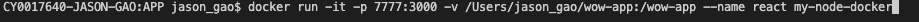
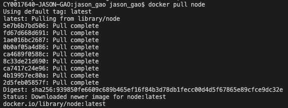

# Docker
讓開發者打包應用和依賴包至一個輕量級可移植的容器中，然後發佈到任何Linux機器上。

## Docker 三個基本概念
映像檔(Image): Image 是 container 的樣板  
容器(Container): 應用透過容器執行  
倉庫(Repository): 映像檔倉庫

容器化技術？
## VM 虛擬機 和 container 差異
VM: 不同的Application 建立在不同的guest OS中還必須安裝各自的package，VM佔用的資源較大。  
Container: 將Application 以及依賴資源封裝在container中，容器間彼此獨立運行，其相依資源也可重複利用以及搬遷。

## Docker 指令  

|  指令   | 用法  |
|  ----  | ----  |
|   ps   | 查看container  |
|   run   | 建立container 並執行指令  |
|   exec   | 在外部向container 內執行指令  |
|   stop   | 停止執行中的 container |
|   rm   | 刪除container  |
|   rmi   | 刪除image  |
|   build   | 建立dockerfile  |
|   images   | 查看images  |

parameter
|  指令   | 用法  |
|  ----  | ----  |
|   -a   | 列出映像檔資訊  |
|   -d   | 背景執行  |
|   -p   | port |
|   -v   | 資料夾對應 |
|   -t   | 分配一個虛擬終端 |

## Docker 使用  
### container使用
1. 運行容器輸出信息  
> $ docker run node /bin/echo "HiHi"  

 - run: 運行容器 ｜ node:指定鏡像 ｜ ／bin/echo: 執行打印命令   
2. 運行交互容器  
> $ docker run  < image >  
  
 - -t: 指定終端 ｜ －i: 使用交互操作
3. 啟動容器(後台模式)  
> $ docker run -d  
  

4. 容器停止  
> $ docker stop < Container ID >  
  
5. 容器重啟 
> $ docker restart < Container ID >   
  
9. 進入容器  
> $ docker exec -it < Container ID > /bin/bash  
  
 - /bin/bash: 開啟shell   
7. 刪除容器  
> $ docker rm < Container ID >   
  
### image使用
1. 鏡像列表  
> $ docker images  
  
 - REPOSITORY: 倉庫源 ｜ TAG:鏡像標籤(版本) 
2. 查找鏡像  
> $ docker search < images > -f is-official=true  
  
 - -f: 過濾條件 is-official=true 代表是否為官方
3. 拉取鏡像  
> $ docker pull < images >  
  
4. 刪除鏡像  
> $ docker rmi < images >  
  
5. 更新鏡像  
> $ docker commit -m "update" -a=< another > < images > < images name >  
  
  
 - -m: 描述 | -a: 指定作者 | jason/node:v2 :鏡像名稱  
6. 構建node鏡像  
  
  
6. 以構建鏡像運行容器  
> $ docker run -it -p <本機 port:Container port> -v < project path > --name < container name > < images >  
 
 

## Docker Compose
透過 Compose 可以使用yml文件配置程序所有需要的服務，一個命令就可從配置文件中創建並啟動所有服務 

compose 三個步驟
 - 使用Dockerfile 定義程序環境  
 - 使用docker-compose.yml 定義程序服務  
 - 執行 docker-compose up 來啟動並運行整個應用程序  
 

## Docker 實例
1. Install Docker  

2. 搜尋映像檔案(Image)  

3. 從官方倉庫(Repository)拉取映像檔  

4. 列出映像檔  

5. 啟動容器  

6. 在容器中執行命令  

6. 在容器中運行react  
  

