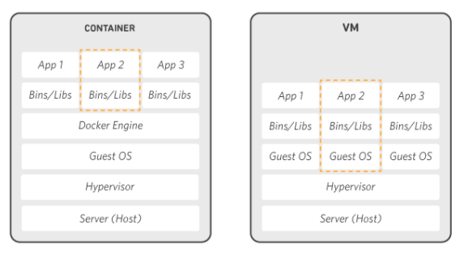

# Docker

容器化技術?  
## VM 虛擬機 和 container 差異
VM: 不同的 Application 建立在不同的 guest OS 中還必須安裝各自的 package，VM 佔用的資源較大。  
Container: 將 Application 以及依賴資源封裝在 container 中，容器間彼此獨立運行，其相依資源也可重複利用以及搬遷。  

## Container 標準化
Docker 將 Container 內的所有程式（包括應用程式、相關函式庫、設定檔），都打包進 Docker 映象檔，並且提供了一個 Dockerfile 設定檔來記錄建立 Container 過程的每一個步驟包括參數。只要在任何支援 Docker 平臺的環境中，就可以從這個映象檔來建立出一個一模一樣的 Container 來執行同一個應用程式。如此一來，應用程式等於是可以透過 Docker 映象檔，或甚至只需要 Dockerfile，就能將程式執行環境帶著走，移動到任何支援 Docker 的環境中。

## Docker 三個基本概念
### 映像檔(Image):   
Docker 映像檔是一個模板，用來重複產生容器實體。例如：一個映像檔裡可以包含一個完整的 MySQL 服務、一個 Golang 的編譯環境、或是一個 Ubuntu 作業系統。透過 Docker 映像檔，我們可以快速的產生可以執行應用程式的容器。  
### 容器(Container):  
容器是用映像檔建立出來的執行實例。它可以被啟動、開始、停止、刪除。每個容器都是相互隔離、保證安全的平台。  
### 倉庫(Repository): 
倉庫是集中存放映像檔檔案的場所。  
## Docker 指令  

|  指令   | 用法  |
|  ----  | ----  |
|   ps   | 查看 container  |
|   run   | 建立 container 並執行指令  |
|   exec   | 在外部向 container 內執行指令  |
|   stop   | 停止執行中的 container |
|   rm   | 刪除 container  |
|   rmi   | 刪除 image  |
|   build   | 建立 dockerfile  |
|   images   | 查看 images  |

parameter
|  指令   | 用法  |
|  ----  | ----  |
|   -a   | 列出映像檔資訊  |
|   -d   | 背景執行  |
|   -p   | port |
|   -v   | 資料夾對應 |
|   -t   | 分配一個虛擬終端 |

## Docker 使用  
### container使用
1. 運行容器輸出信息  
> $ docker run node /bin/echo "HiHi"  

 - run: 運行容器 ｜ node: 指定鏡像 ｜ ／bin/echo: 執行打印命令   
2. 運行交互容器  
> $ docker run  < image >  
  
 - -t: 指定終端 ｜ －i: 使用交互操作
3. 啟動容器(後台模式)  
> $ docker run -d  
  

4. 容器停止  
> $ docker stop < Container ID >  
  
5. 容器重啟 
> $ docker restart < Container ID >   
  
9. 進入容器  
> $ docker exec -it < Container ID > /bin/bash  
  
 - /bin/bash: 開啟shell   
7. 刪除容器  
> $ docker rm < Container ID >   
  
### image使用
1. 鏡像列表  
> $ docker images  
  
 - REPOSITORY: 倉庫源 ｜ TAG:鏡像標籤(版本) 
2. 查找鏡像  
> $ docker search < images > -f is-official=true  
  
 - -f: 過濾條件 is-official=true 代表是否為官方
3. 拉取鏡像  
> $ docker pull < images >  
  
4. 刪除鏡像  
> $ docker rmi < images >  
  
5. 更新鏡像  
> $ docker commit -m "update" -a=< another > < images > < images name >  
  
  
 - -m: 描述 | -a: 指定作者 | jason/node:v2 :鏡像名稱  
6. 構建node鏡像  
  
  
6. 以構建鏡像運行容器  
> $ docker run -it -p <本機 port:container port> -v < folder path > --name < container name > < images >  
 
 

## Docker Compose
透過 Compose 可以使用yml文件配置程序所有需要的服務，一個命令就可從配置文件中創建並啟動所有服務 

compose 三個步驟
 - 使用 Dockerfile 定義程序環境  
 - 使用 docker-compose.yml 定義程序服務  
 - 執行 docker-compose up 來啟動並運行整個應用程序  
 

## Docker 實例
1. Install Docker  

2. 搜尋映像檔案(Image)  

3. 從官方倉庫(Repository)拉取映像檔  

4. 列出映像檔  

5. 啟動容器  

6. 在容器中執行命令  

6. 在容器中運行react  
  

