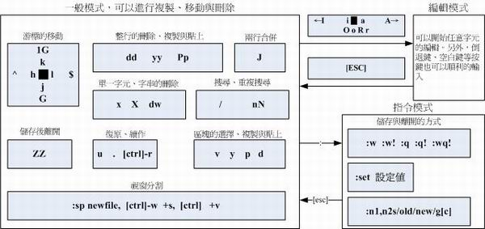

# Linux 基本應用
> vi 文字編輯器
有的 Unix Like 系統都會內建 vi 文書編輯器
很多個別軟體的編輯介面都會主動呼叫 vi (例如未來會談到的 crontab, visudo, edquota 等指令)；
vim 具有程式編輯的能力，可以主動的以字體顏色辨別語法的正確性，方便程式設計；
因為程式簡單，編輯速度相當快速。

## vi 三種模式

### 一般指令模式 (command mode)
> 可以使用『上下左右』按鍵來移動游標，你可以使用『刪除字元』或『刪除整列』來處理檔案內容， 也可以使用『複製、貼上』來處理你的文件資料。
### 編輯模式 (insert mode)
> 按下『i, I, o, O, a, A, r, R』等任何一個字母之後才會進入編輯模式。在畫面的左下方會出現『 INSERT 或 REPLACE 』的字樣，此時才可以進行編輯。而如果要回到一般指令模式時， 則必須要按下『Esc』這個按鍵即可退出編輯模式。
### 指令列命令模式 (command-line mode)
> 輸入『 : / ? 』三個中的任何一個按鈕，就可以將游標移動到最底下那一列。在這個模式當中， 可以提供你『搜尋資料』的動作，而讀取、存檔、大量取代字元、離開 vi 、顯示行號等等的動作則是在此模式中達成的！

## vi 使用

#### 建立檔案
> 直接輸入『 vi 檔名』就能夠進入 vi 的一般指令模式了。   

#### 編輯檔案
> 在一般指令模式之中，只要按下 i, o, a 等字元就可以進入編輯模式了  

#### 回到一般指令模式
> 按下 [ESC] 按鈕回到一般指令模式

#### 離開 vi 環境  
> 輸入『:wq』即可存檔離開！ 
> 輸入『 ls -l 』即可看到我們剛剛建立的檔案.  

## 常用按鈕
|  快捷   | 用法  |
|  ----  | ----  |
| [Ctrl] + [f]  | 螢幕『向下』移動一頁，相當於 [Page Down]按鍵  |
| [Ctrl] + [b]  | 螢幕『向上』移動一頁，相當於 [Page Up] 按鍵 |
| 0 或功能鍵[Home]  | 移動到這一列的最前面字元處 |
| $ 或功能鍵[End]  | 移動到這一列的最後面字元處 |
| g  | 移動到這個檔案的最後一列 |
| gg  | 移動到這個檔案的第一列 |
| n<Enter>  | n 為數字。游標向下移動 n 列 |
| n<Enter>  | n 為數字。游標向下移動 n 列 |

## 搜尋與取代
|  快捷   | 用法  |
|  ----  | ----  |
| /word  | 向游標之下尋找一個名稱為 word 的字串。例如要在檔案內搜尋 vbird 這個字串，就輸入 /vbird |
| :n1,n2s/word1/word2/g  | n1 與 n2 為數字。在第 n1 與 n2 列之間尋找 word1 這個字串，並將該字串取代為 word2 ！舉例來說，在 100 到 200 列之間搜尋 vbird 並取代為 VBIRD 則：『:100,200s/vbird/VBIRD/g』。 |
| :1,$s/word1/word2/g  | 從第一列到最後一列尋找 word1 字串，並將該字串取代為 word2 ！ |
| :1,$s/word1/word2/gc  | 從第一列到最後一列尋找 word1 字串，並將該字串取代為 word2 ！且在取代前顯示提示字元給使用者確認 (confirm) 是否需要取代！ |

## 刪除、複製與貼上
|  快捷   | 用法  |
|  ----  | ----  |
|  x, X  | 在一列字當中，x 為向後刪除一個字元， X 為向前刪除一個字元  |
|  dd  | 刪除游標所在的那一整列  |
|  ndd  | n 為數字。刪除游標所在的向下 n 列，例如 20dd 則是刪除 20 列  |
|  yy  | 複製游標所在的那一列  |
|  nyy  | n 為數字。複製游標所在的向下 n 列，例如 20yy 則是複製 20 列  |
|  p, P  | p 為將已複製的資料在游標下一列貼上，P 則為貼在游標上一列！ 舉例來說，我目前游標在第 20 列，且已經複製了 10 列資料。則按下 p 後， 那 10 列資料會貼在原本的 20 列之後，亦即由 21 列開始貼。但如果是按下 P 呢？ 那麼原本的第 20 列會被推到變成 30 列。|
|  u  | 復原前一個動作。  |
|  [Ctrl]+r  | 重做上一個動作。  |
|  .  | 重複前一個動作的意思。 如果你想要重複刪除、重複貼上等等動作。  |

## 儲存、離開等指令
|  快捷   | 用法  |
|  ----  | ----  |
|  :w  | 將編輯的資料寫入硬碟檔案中  |
|  :q  | 離開 vi  |
|  :wq  | 儲存後離開，若為 :wq! 則為強制儲存後離開  |

## 常用指令圖

# Git 應用
### 建立分支
> git branch < branchname >
### 切換分支
> git checkout < branch >
### 合併分支
> git merge < commit >
### 刪除分支
> git branch -d < branch >
