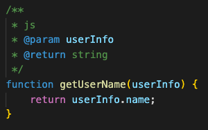
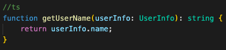
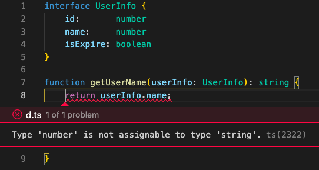
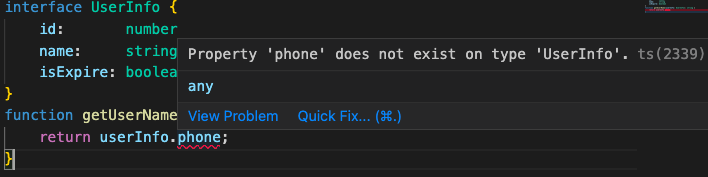
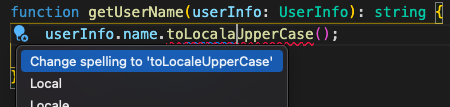

# TypeScript
引入Java 或 C# 類似的強型別概念

## 優點
1. 可以在編譯時幫助檢查 語法是否打錯 或是 型別對應不正確
2. 代碼可讀性不需要添加註解，閱讀時方便理解需要傳入的 parameter type 和 return type
3. 自動完成、導入

# 範例
型別註釋  
  

靜態型別檢查  

    // js
    function getUserName(userInfo){
        return userInfo.name;
    }
    
    // ts
    interface UserInfo {
        id:       number
        name:     string
        isExpire: boolean
    }
    function getUserName(userInfo: UserInfo): string {
        return userInfo.name;
    }

未定義屬性:  

錯別字:  

常數運用提升可讀性:
    
    // 未使用 Enum
    const handleUserStatus = (status) => {
        switch(status){
            case 0:
                // is online ...
                return;
            case 1:
                // is offline ...
                return;
        }
    }

    //使用 Enum 
    enum UserStatus {
        online = 0,
        offline = 1
    }

    const handleUserStatus = (status) => {
        switch(status){
            case UserStatus.online:
                // is online ...
                return;
            case UserStatus.offline:
                // is offline ...
                return;
        }
    }

可選參數:

    function getUserName(userInfo?: UserInfo): string {
        return userInfo ? userInfo.name : 'default';
    }

    getUserName(); // return 'default'

變數型別兼容

    let value: string | number = 'Hi'
    value = 0